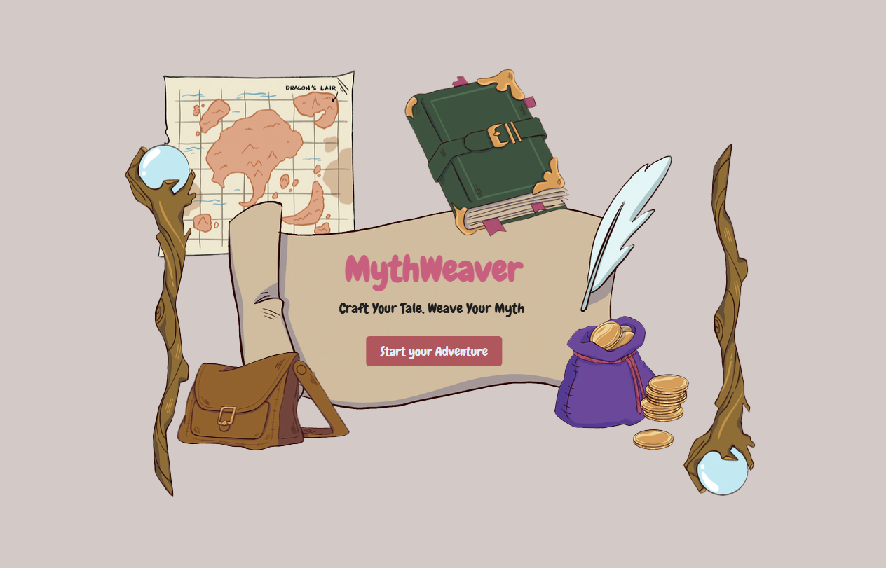
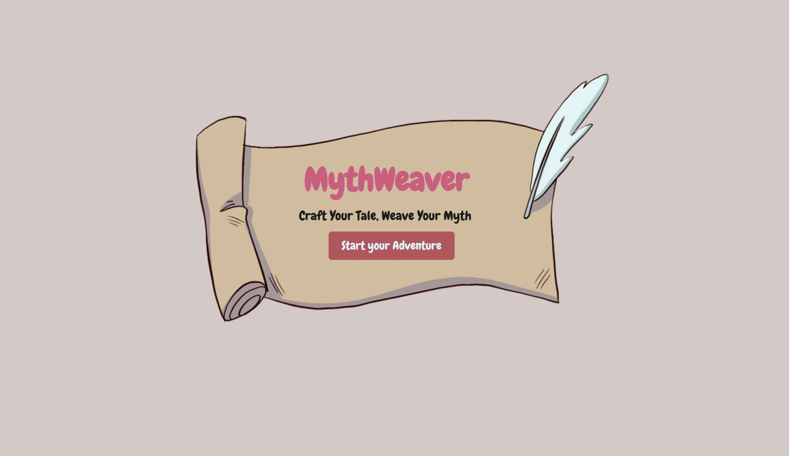

    <!-- PROJECT SHIELDS -->
    
    
    
    
    

 

<h3 align="center">:scroll: MythWeaver</h3>

  

    Interactive, Multiple Endings Storytelling Platform
     
     
    <a href="https://github.com/sara-hines/myth-weaver"><strong>Explore the docs »</strong></a>
     
     
    <a href="#usage-and-features">View Features</a>
    ·
    <a href="https://github.com/sara-hines/myth-weaver/issues/new?labels=bug&template=bug-report---.md">Report a Bug</a>
    ·
    <a href="https://github.com/sara-hines/myth-weaver/issues/new?labels=enhancement&template=feature-request---.md">Request a Feature</a>
  

 
<!-- TABLE OF CONTENTS -->

  
Table of Contents

  <ol>
    <li>
      <a href="#description">Description</a>
      <ul>
        <li><a href="#built-with">Built With</a></li>
      </ul>
    </li>
    <li>
      <a href="#installation">Installation</a>
    </li>
    <li>
        <a href="#usage-and-features">Usage and Features</a>
        <ul>
            <li>
                <a href="#features-when-not-logged-in">Features When Not Logged In</a>
                <ul>
                    <li><a href="#landing-page-welcome-to-mythweaver">Landing Page: Welcome to MythWeaver!</a></li>
                    <li><a href="#play-through-a-story">Play through a Story</a></li>
                    <li><a href="#rate-and-review-a-story">Rate and Review a Story</a></li>
                    <li><a href="#visit-the-about-us-page-and-contact-us">Visit the About Us page and Contact Us</a></li>
                </ul>
            </li>
            <li>
                <a href="#sign-up-and-login-functionality">Sign Up and Login Functionality</a>
                <ul>
                    <li><a href="#sign-up-functionality">Sign Up Functionality</a></li>
                    <li><a href="#login-functionality">Login Functionality</a></li>
                </ul>
            </li>
            <li>
                <a href="#additional-features-available-to-logged-in-users">Additional Features Available to Logged In Users</a>
                <ul>
                    <li><a href="#user-profile-page">User Profile Page</a></li>
                    <li><a href="#create-a-story">Create a Story</a></li>
                    <li><a href="#access-created-stories-to-be-read-list-and-bookmarks">Access Created Stories, To Be Read List, and Bookmarks</a></li>
                    <!-- Make sure to talk about how each of the 3 things can be deleted/removed as well, and in the multiple places they can be removed -->
                </ul>
            </li>
            <li>
                <a href="#responsive-design">Responsive Design</a>
            </li>
        </ul>
    </li>
    <li><a href="#future-development">Future Development</a></li>
    <li><a href="#contributing">Contributing</a></li>
    <li><a href="#license">License</a></li>
    <li><a href="#contact">Contact</a></li>
    <li><a href="#acknowledgments">Acknowledgments</a></li>
  </ol>

 

<!-- ABOUT THE PROJECT -->
## Description

(<a href="#readme-top">back to top</a>)

### Built With

- [![Apollo-GraphQL][Apollo-GraphQL-badge]][Apollo-GraphQL-url]
- [![React][React.dev]][React-url]
- [![React-Router][React-Router-badge]][React-Router-url]
- [![Mongo][MongoDB]][Mongo-url]
- [![Mongoose][Mongoosejs]][Mongoose-url]
- [![Express][Express.js]][Express-url]
- [![Node][Node.js]][Node-url]
- [![Javascript][JavaScript]][Javascript-url]
- [![JWT][JWT-badge]][JWT-url]
- [![Cloudinary][Cloudinary-badge]][Cloudinary-url]
- [![Nodemon][Nodemon.io]][Nodemon-url]
- [![Render][Render-badge]][Render-url]

(<a href="#readme-top">back to top</a>)

<!-- GETTING STARTED -->
## Installation

No installation is needed to view and engage with this interactive storytelling platform—simply navigate to the site at [https://myth-weaver.onrender.com](https://myth-weaver.onrender.com). Feel free to follow along with the screenshots and GIFs in the Usage and Features section, or to take a self-directed tour around the site and experience all that MythWeaver has to offer!

<!-- USAGE EXAMPLES -->
## Usage and Features

### Features When Not Logged In

#### Landing Page: Welcome to MythWeaver!

Welcome to our creative storytelling platform! When users first arrive, they are greeted by an unfurled scroll and quill pen, inviting them to enter the site and start their adventure. Fantasy-inspired elements including a weathered map, a travelor's satchel, and an enchanted book appear also appear on larger screens. 

 

 

#### Play through a Story

MythWeaver offers interactive, imaginative, choose-your-own-adventure-style stories across a variety of genres, including high fantasy, sword and sorcery, cyberpunk, solarpunk, and science fiction. Each story is tagged to highlight specific themes, such as magical alliances, dystopian futures, eco-adventures, ancient prophecies, horror, supernatural elements, hero's journeys, magical artifacts, sentient AI, and political intrigue. Whether you're seeking a light, magical hero's journey, a relaxing, nature-focused solarpunk experience, or a high-stakes, futuristic dystopian narrative, you'll find a story that matches your mood.

On the home page, each story displays its title, image thumbnail, and description, allowing users to quickly browse and find stories of interest. Clicking on a story navigates the user to its front page, where they can view details such as the author, genre, tags, and average rating. Users can rate stories from 1 to 5 stars, and the average rating serves as a helpful indicator of a story's reception. With information on genre, tags, star ratings, and descriptions, users have ample resources to decide whether they'd like to delve into a particular story.

For users who haven't signed up, or are not logged in, the most core functionalities of the site are still available: playing through stories, rating and reviewing stories, and submitting feedback to the site creators. The following GIF demonstrates this core functionality from the perspective of a logged-out user. It begins at the landing page, proceeds to the home page after clicking the "Start your Adventure" button, and then showcases a playthrough of "Neon Abyss: The Cyberpunk Adventure," set in the futuristic neon-lit city of Neo-Tokyo. Each choice you make pushes the story towards a different outcome and ending. Some storylines can overlap, but users ultimately have the ability to shape the story and drive the plot. In many of our stories, some of the choices lead to the protagonist failing in their goals, while others push the protagonist towards improving their world or achieving their aspirations. To demonstrate, "Neon Abyss: The Cyberpunk Adventure," is a cyberpunk story which goes deeper into the genre's themes than just exemplifying the neon aesthetic that cyberpunk can sometimes be known for. The story has some grit and variety in its various paths—the ability to betray potential allies, make shady dealings, or cause chaos, in addition to the ability to improve their dystopian world. It exemplifies the plot-shaping agency that choose-your-own-adventure-style stories offer.

Feel free to follow along with our (fictional) Derek Sosa as he plays through "Neon Abyss: The Cyberpunk Adventure," and leaves a rating and review.

#### Rate and Review a Story

For a deeper look into the reviewing functionality, the below GIF shows 3 logged-in users adding reviews to "Neon Abyss: The Cyberpunk Adventure," impacting the story's average rating. The (rounded) average star rating updates with each review 

#### Visit the About Us page and Contact Us

(<a href="#readme-top">back to top</a>)

### Sign Up and Login Functionality

#### Sign Up Functionality

#### Login Functionality

(<a href="#readme-top">back to top</a>)

### Additional Features Available to Logged In Users

#### User Profile Page

#### Create a Story

#### Access Created Stories, To Be Read List, and Bookmarks

(<a href="#readme-top">back to top</a>)

### Responsive Design

(<a href="#readme-top">back to top</a>)

<!-- Future Development -->
## Future Development

<!-- CONTRIBUTING -->
## Contributing

Contributions are what make the open source community such an amazing place to learn, inspire, and create. Any contributions you make are **greatly appreciated**.

If you have a suggestion that would make this better, please fork the repo and create a pull request. You can also simply open an issue with the tag "enhancement".

Don't forget to give the project a star! Thanks again!

1. Fork the Project
2. Create your Feature Branch (`git checkout -b feature/AmazingFeature`)
3. Commit your Changes (`git commit -m 'Add some AmazingFeature'`)
4. Push to the Branch (`git push origin feature/AmazingFeature`)
5. Open a Pull Request

(<a href="#readme-top">back to top</a>)

<!-- LICENSE -->
## License

This project is covered under the MIT License. You can learn more about this license and its coverage and permissions [here](https://opensource.org/licenses/MIT).

(<a href="#readme-top">back to top</a>)

<!-- CONTACT -->
## Contact

If you have any questions/thoughts about this project or would like to connect, feel free to reach out to: 

* Me, Sara Hines, at https://github.com/sara-hines/ or sara.marie.hines1@gmail.com
* Rebeca Thornburg at https://github.com/Rthornburg-Ardi/ or thornburg.rebeca1@gmail.com

Thank you for your interest, and we look forward to hearing from you!

(<a href="#readme-top">back to top</a>)

<!-- ACKNOWLEDGMENTS -->
## Acknowledgments

This README was made from a modified template created by [@othneildrew](https://github.com/othneildrew). View the original [here](https://github.com/othneildrew/Best-README-Template).

(<a href="#readme-top">back to top</a>)

[Apollo-GraphQL-badge]: https://img.shields.io/badge/Apollo%20GraphQL-311C87?&style=for-the-badge&logo=Apollo%20GraphQL&logoColor=white
[Apollo-GraphQL-url]: https://www.apollographql.com/
[React.dev]: https://img.shields.io/badge/React-20232A?style=for-the-badge&logo=react&logoColor=61DAFB
[React-url]: https://react.dev/
[React-Router-badge]: https://img.shields.io/badge/React_Router-CA4245?style=for-the-badge&logo=react-router&logoColor=white
[React-Router-url]: https://reactrouter.com/en/main
[MongoDB]: https://img.shields.io/badge/MongoDB-%234ea94b.svg?style=for-the-badge&logo=mongodb&logoColor=white
[Mongo-url]: https://www.mongodb.com
[Mongoosejs]: https://img.shields.io/badge/Mongoose-880000?style=for-the-badge&logo=mongoose&logoColor=white
[Mongoose-url]: https://mongoosejs.com/
[Express.js]: https://img.shields.io/badge/express.js-%23404d59.svg?style=for-the-badge&logo=express&logoColor=%2361DAFB
[Express-url]: https://expressjs.com/
[Node.js]: https://img.shields.io/badge/node.js-6DA55F?style=for-the-badge&logo=node.js&logoColor=white
[Node-url]: https://nodejs.org
[JavaScript]: https://img.shields.io/badge/javascript-%23323330.svg?style=for-the-badge&logo=javascript&logoColor=%23F7DF1E
[Javascript-url]: https://ecma-international.org/publications-and-standards/standards/ecma-262/
[JWT-badge]: https://img.shields.io/badge/JWT-000000?style=for-the-badge&logo=JSON%20web%20tokens&logoColor=white
[JWT-url]: https://jwt.io/  
[Cloudinary-badge]: https://img.shields.io/badge/Cloudinary-3448C5?style=for-the-badge&logo=Cloudinary&logoColor=white
[Cloudinary-url]: https://cloudinary.com/
[Nodemon.io]: https://img.shields.io/badge/NODEMON-%23323330.svg?style=for-the-badge&logo=nodemon&logoColor=%BBDEAD
[Nodemon-url]: https://nodemon.io/
[Render-badge]: https://img.shields.io/badge/Render-%46E3B7.svg?style=for-the-badge&logo=render&logoColor=white
[Render-url]: https://render.com/
