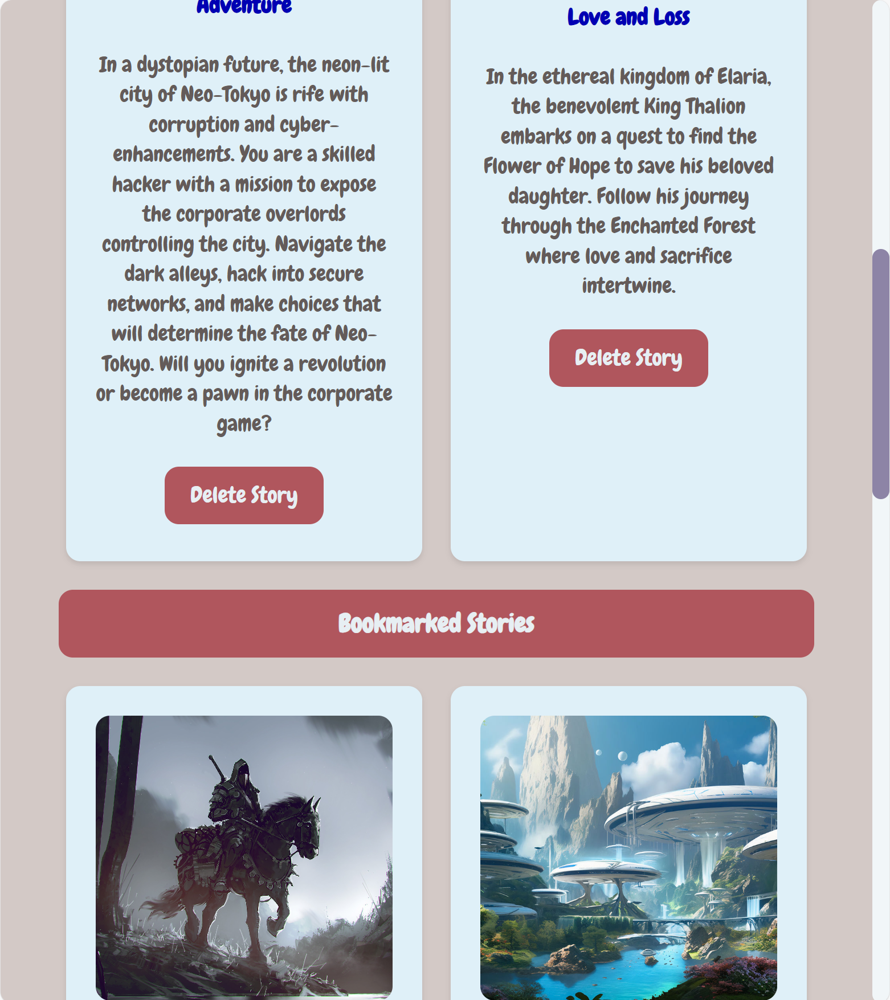
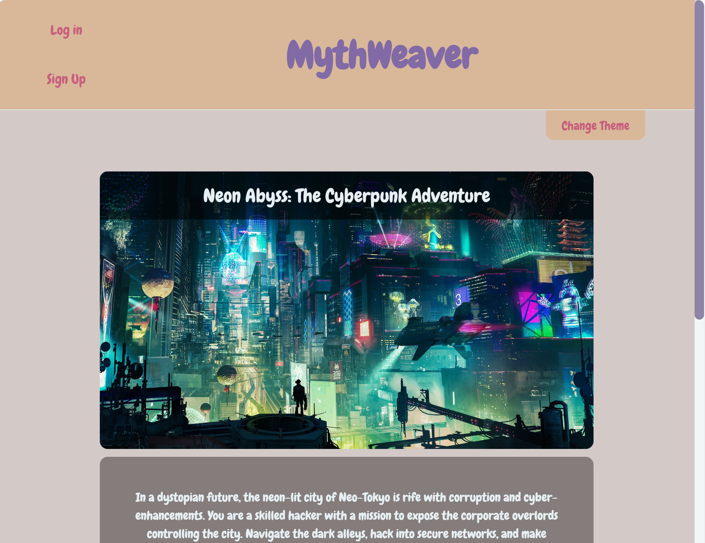
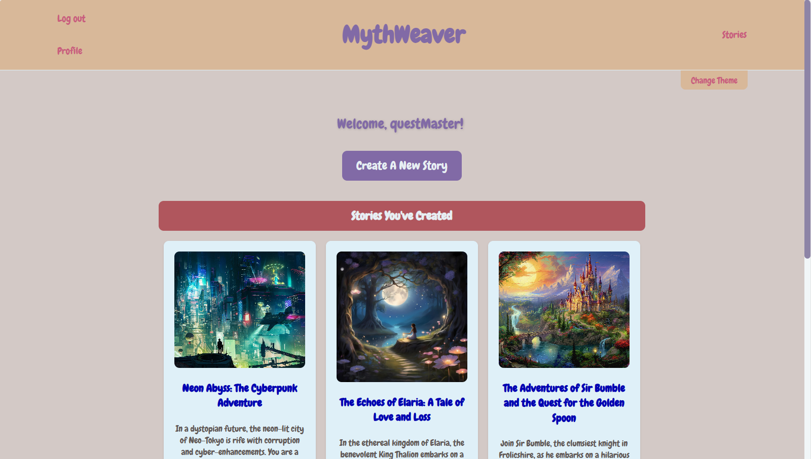

    <!-- PROJECT SHIELDS -->
    
    
    
    
    

 

<h3 align="center">:scroll: MythWeaver</h3>

  

    Interactive, Multiple Endings Storytelling Platform
     
     
    <a href="https://github.com/sara-hines/myth-weaver"><strong>Explore the docs »</strong></a>
     
     
    <a href="#usage-and-features">View Features</a>
    ·
    <a href="https://github.com/sara-hines/myth-weaver/issues/new?labels=bug&template=bug-report---.md">Report a Bug</a>
    ·
    <a href="https://github.com/sara-hines/myth-weaver/issues/new?labels=enhancement&template=feature-request---.md">Request a Feature</a>
  

 
<!-- TABLE OF CONTENTS -->

  
Table of Contents

  <ol>
    <li>
      <a href="#memo-description">Description</a>
      <ul>
        <li><a href="#toolbox-tech-stack">Tech Stack</a></li>
      </ul>
    </li>
    <li>
      <a href="#star2-getting-started">Getting Started</a>
      <ul>
        <li><a href="#gear-installation">Installation</a></li>
        <li><a href="#camera-demo-videos-and-resources">Demo Videos and Resources</a></li>
      </ul>
    </li>
    <li>
        <a href="#eyes-usage-and-features">Usage and Features</a>
        <ul>
            <li>
                <a href="#features-when-not-logged-in">Features When Not Logged In</a>
                <ul>
                    <li><a href="#landing-page-welcome-to-mythweaver">Landing Page: Welcome to MythWeaver!</a></li>
                    <li><a href="#play-through-a-story">Play through a Story</a></li>
                    <li><a href="#rate-and-review-a-story">Rate and Review a Story</a></li>
                    <li><a href="#visit-the-about-us-page-and-contact-us">Visit the About Us page and Contact Us</a></li>
                </ul>
            </li>
            <li>
                <a href="#sign-up-and-login-functionality">Sign Up and Login Functionality</a>
            </li>
            <li>
                <a href="#additional-features-available-to-logged-in-users">Additional Features Available to Logged In Users</a>
                <ul>
                    <li><a href="#user-profile-page">User Profile Page</a></li>
                    <li><a href="#create-a-story">Create a Story</a>
                      <ul>
                        <li><a href="#planning-your-story">Planning Your Story</a></li>
                        <li><a href="#resources-to-walk-you-through-creating-a-story">Resources To Walk You Through Creating a Story</a></li>
                        <li><a href="#the-start-your-story-modal">The 'Start Your Story' Modal</a></li>
                        <li><a href="#how-to-use-chapters">How To Use Chapters</a></li>
                        <li><a href="#the-add-new-chapter-modal">The 'Add New Chapter' Modal</a></li>
                        <li><a href="#the-add-new-chapter-for-choice-modal">The 'Add New Chapter for Choice' Modal</a></li>
                        <li><a href="#finalizing-your-story">Finalizing Your Story</a></li>
                      </ul>
                    </li>
                    <li><a href="#access-created-stories-to-be-read-list-and-bookmarks">Access Created Stories, To Be Read List, and Bookmarks</a>
                      <ul>
                        <li><a href="#created-stories">Created Stories</a></li>
                        <li><a href="#to-be-read-list-and-bookmarks">To Be Read List and Bookmarks</a></li>
                      </ul>
                    </li>
                </ul>
            </li>
            <li>
                <a href="#white_check_mark-responsive-design">Responsive Design</a>
                <ul>
                  <li><a href="#tablets-and-large-phones">Tablets and Large Phones</a></li>
                  <li><a href="#small-laptops-and-landscape-tablets">Small Laptops and Landscape Tablets</a></li>
                  <li><a href="#laptops-and-small-desktops">Laptops and Small Desktops</a></li>
                  <li><a href="#very-large-screens">Very large screens</a></li>
                </ul>
            </li>
        </ul>
    </li>
    <li><a href="#seedling-future-development">Future Development</a></li>
    <li><a href="#wave-contributing">Contributing</a></li>
    <li><a href="#grey_exclamation-license">License</a></li>
    <li><a href="#handshake-contact">Contact</a></li>
    <li><a href="#sparkles-acknowledgments">Acknowledgments</a></li>
  </ol>

 

<!-- ABOUT THE PROJECT -->
## :memo: Description

MythWeaver is an innovative platform designed for interactive storytelling, allowing users to craft and experience Choose Your Own Adventure (CYOA) stories. CYOA stories invite readers to make choices that shape the narrative's path, with the story's conclusion determined by the decisions they make along the way. The reader is empowered to impact the world of the story through their choices, and the author has the opportunity to share more facets of that world than they would in traditional fiction. Traditional fiction on its own has the potential to broaden minds and foster empathy through diverse perspectives. At MythWeaver, we believe that CYOA stories enhance the transformative potential of traditional fiction, and we aim to provide a platform for readers and authors inspire and be inspired. 

Born from a collaborative spirit during a coding bootcamp at the University of Denver, our team recognized a need for a community-driven platform where interactive storytelling could flourish. Existing tools for interactive fiction such as inklewriter and Twine focus mainly on supporting writers—these tools don't provide an in-house UI for readers to experience the stories, or a forum for dialogue about the stories. MythWeaver fills a crucial gap by providing a vibrant space for creating, reading, and discussing stories. Our platform not only supports the creative process but also aims to foster a deeper connection between authors and their audiences. 

Utilizing a modern tech stack of React, Apollo GraphQL, and MongoDB, MythWeaver offers an engaging user interface that invites exploration and creativity. Readers can explore a dynamic library of interactive stories across genres from high fantasy to science fiction, experience those stories through our fantasy-inspired user interface, and organize their reading goals with their Bookmarks and To Be Read lists. Writers can create CYOA stories, share their work, receive feedback, and generate a following, all on a single platform. The ratings and reviews section provides a space for conversation about each story, helping readers and writers to connect. Whether you’re a writer looking to bring your stories to life or a reader eager to immerse yourself in imaginative worlds, MythWeaver is the perfect platform to unleash your creativity and explore the limitless potential of interactive storytelling. 

(<a href="#readme-top">back to top</a>)

### :toolbox: Tech Stack

- [![Apollo-GraphQL][Apollo-GraphQL-badge]][Apollo-GraphQL-url]
- [![React][React.dev]][React-url]
- [![React-Router][React-Router-badge]][React-Router-url]
- [![Mongo][MongoDB]][Mongo-url]
- [![Mongoose][Mongoosejs]][Mongoose-url]
- [![Express][Express.js]][Express-url]
- [![Node][Node.js]][Node-url]
- [![Javascript][JavaScript]][Javascript-url]
- [![JWT][JWT-badge]][JWT-url]
- [![Cloudinary][Cloudinary-badge]][Cloudinary-url]
- [![Nodemon][Nodemon.io]][Nodemon-url]
- [![Render][Render-badge]][Render-url]

(<a href="#readme-top">back to top</a>)

<!-- GETTING STARTED -->
## :star2: Getting Started

### :gear: Installation

No installation is needed to view and engage with this interactive storytelling platform—simply navigate to the site at [https://myth-weaver.onrender.com](https://myth-weaver.onrender.com). Feel free to follow along with the GIFs and videos in the Usage and Features section, or to take a self-directed tour around the site and experience all that MythWeaver has to offer!

### :camera: Demo Videos and Resources

Several demo videos are linked and referred to throughout the [Usage and Features](#eyes-usage-and-features) section. If you want to jump straight to the demo videos, you can find them below: 

* [Neon Abyss: The Cyberpunk Adventure Story Playthrough](https://drive.google.com/file/d/1e7_8KssZVH1e0n1v_vIul5PdBdOX6VI0/view?usp=sharing)
* [Create Story Demo Video](https://drive.google.com/file/d/1-ule82vMbHndeoP1IH8Bu_dkQx34MaJO/view?usp=drive_link)
* [The Enchanted Forest Playthrough](https://drive.google.com/file/d/1VS02JcQDtiOp4Wuord6uHQXwDEmbHoRK/view?usp=drive_link)
* [Delete Story and Bookmarks Demo Video](https://drive.google.com/file/d/1UOy4G2lIRYdU07vleqOMrr5H2O9VXmxc/view?usp=drive_link)
* [To Be Read List Demo Video](https://drive.google.com/file/d/13PM91zN4z3ioksUqa_I3Jhv302AwoiZQ/view?usp=drive_link)

Note: this README features GIFs and videos showcasing our mobile-friendly design at 440px. Check out the [Responsive Design](#responsive-design) section to see examples of the site at tablet and desktop viewport widths!

(<a href="#readme-top">back to top</a>)

<!-- USAGE EXAMPLES -->
## :eyes: Usage and Features

### Features When Not Logged In

#### Landing Page: Welcome to MythWeaver!

Welcome to our creative storytelling platform! When users first arrive, they are greeted by an unfurled scroll and quill pen, inviting them to enter the site and start their adventure. Fantasy-inspired elements including a weathered map, a traveler's satchel, and an enchanted book appear also appear on larger screens. 

 

 

#### Play through a Story

MythWeaver offers interactive, imaginative, choose your own adventure stories across a variety of genres, including high fantasy, sword and sorcery, cyberpunk, solarpunk, and science fiction. Each story is tagged to highlight specific themes, such as magical alliances, ancient prophecies, supernatural elements, sentient AI, and political intrigue. Whether you're seeking a light, magical hero's journey, a relaxing, nature-focused solarpunk experience, or a high-stakes, futuristic dystopian narrative, you'll find a story that matches your mood.

On the home page, each story displays its title, image thumbnail, and description, allowing users to quickly browse and find stories of interest. Clicking on a story navigates the user to its front page, where they can view details such as the author, genre, tags, and average rating. Users can rate stories from 1 to 5 stars, and the average rating serves as a helpful indicator of a story's reception. With information on genre, tags, star ratings, and descriptions, users have ample resources to decide whether they'd like to delve into a particular story.

For users who haven't signed up, or are not logged in, the most <strong>core functionalities</strong> of the site are still available: <strong>playing through stories</strong>, <strong>rating and reviewing stories</strong>, and <strong>submitting feedback to the site creators</strong>. The following GIF demonstrates this core functionality from the perspective of a logged-out user. It begins at the landing page, proceeds to the home page after clicking the "Start your Adventure" button, and then showcases a playthrough of "Neon Abyss: The Cyberpunk Adventure," set in the futuristic neon-lit city of Neo-Tokyo. 

Each choice you make pushes the story towards a different outcome and ending. Some storylines can overlap, but users ultimately have the ability to shape the story and drive the plot. In many of our stories, some of the choices lead to the protagonist failing in their goals, while others push the protagonist towards improving their world or achieving their aspirations. To demonstrate, "Neon Abyss: The Cyberpunk Adventure," is a cyberpunk story which goes deeper into the genre's themes than just exemplifying the neon aesthetic that cyberpunk can sometimes be known for. The story has some grit and variety in its various paths—the ability to betray potential allies, make shady dealings, or cause chaos, in addition to the ability to improve their dystopian world. It exemplifies the plot-shaping agency that choose your own adventure stories offer.

Feel free to follow along with our (fictional) Derek Sosa as he plays through "Neon Abyss: The Cyberpunk Adventure," and leaves a rating and review.

 

 

#### Rate and Review a Story

For a deeper look into the reviewing functionality, the below GIF shows 3 logged-in users adding reviews to "Neon Abyss: The Cyberpunk Adventure," impacting the story's rounded, average rating. At the beginning of the GIF, the story has a rating of 4 stars, comprised of only one 4 star rating, left by Derek Sosa in the previous GIF. After cyberScribe leaves a 2 star rating, the story's page shows as "Rated 3 stars on average by 2 people." mythicNarrator's 5 star rating bumps the average up to 4 stars, and the story remains at a 4 star average after taleSpinner's additional 5 star rating. 

 

 

Displaying the number of ratings alongside the average rating provides context that enhances its credibility; it allows users to assess whether a high rating reflects the opinion of just a few individuals or a broader consensus from many readers. The rating functionality is designed to be broadly accessible. Any user can rate any story, whether or not they have an account. If a reader prefers not to write a review, but wants to leave a quick star rating, that is an option as well.   

#### Visit the About Us page and Contact Us

Feedback is an important part of any growing, creative platform. All MythWeaver users can provide feedback to the site creators, whether or not they have an account. At the About Us page, accessible from the About Us link in the header, visitors can learn about MythWeaver's aspirations and get to know the site creators. Below the developer bios, the Contact Us form allows visitors to easily submit feedback, questions, and/or bug reports. For quick, convenient access to the Contact Us form, click the Contact Us link in the header to be automatically scrolled to the form.

The below GIF shows a preview of the About Us page, continuing through the Contact Us form and a sample message submission. Real-time feedback throughout the message submission process lets users know when their message is being processed and when it has been successfully sent.

 

 

(<a href="#readme-top">back to top</a>)

### Sign Up and Login Functionality

It's easy to sign up and make the most of your experience with MythWeaver! Just click the 'Sign Up' link in the header, provide a username, email, and password, and click the submit button. Make sure to fulfill the following password requirements for a secure and successful sign-in:

* at least 8 characters long
* at least 1 lowercase letter
* at least 1 uppercase letter
* at least 1 digit
* at least 1 special character

To log in when you already have an account, simply click the 'Log In' link in the header and provide the email and password you signed up with. Check out the GIF below for a quick look at the sign-up and log-in process!

 

 

(<a href="#readme-top">back to top</a>)

### Additional Features Available to Logged In Users

#### User Profile Page

We would love to have you officially join our platform! After you sign up or log in, you will land at the user profile page. As a logged in user, you can create your very own interactive stories, bookmark your favorite stories to revisit again and again, and keep track of stories you want to read in the future using your 'To Be Read List'. As a new user, 'Stories You've Created', 'Bookmarked Stories', and 'To Be Read List' sections on your profile page will start off empty, but won't stay that way for long!

 

 

#### Create a Story

##### Planning Your Story

This is your chance to bring your very own, interactive, Choose Your Own Adventure (CYOA) style stories to life! CYOA stories are all about choice, and the very format lends itself to expansiveness and imagination. With each choice leading to another choice in an increasingly branching decision tree, it's helpful to set some limits and bring some structure to your story ideas. Start from the basic components—a genre, an idea of the world your story takes place in, the problem the protagonist will face, the characters the protagonist will interact with. Having an idea of the protagonist's goals, and any particular themes you want your story to explore, can help you devise the choices to offer the reader at every plot point. For more writing advice, feel free to check out the following resources: 

* Karen Woodward's [How To Write A 'Choose Your Own Adventure' Story](https://blog.karenwoodward.org/2014/06/how-to-write-choose-your-own-adventure.html)
* Overmental's [How to Write a ‘Choose Your Own Adventure,’ Without Tears!](https://overmental.com/content/how-to-write-a-choose-your-own-adventure-without-tears-39302)
* Writers.com's [How to Write a Short Story: The Short Story Checklist](https://writers.com/how-to-write-a-short-story)

##### Resources To Walk You Through Creating a Story

Ready to start building your story? Follow along with the directions below, or walk through the process alongside the [Create Story Demo Video available here](https://drive.google.com/file/d/1-ule82vMbHndeoP1IH8Bu_dkQx34MaJO/view?usp=drive_link). The 4-minute Create Story Demo shows the process of creating a story from start to finish with a short fable story called 'The Enchanted Forest'. You may also find it helpful to watch [The Enchanted Forest Playthrough](https://drive.google.com/file/d/1VS02JcQDtiOp4Wuord6uHQXwDEmbHoRK/view?usp=drive_link) to see how the story diagram from the Create Story Demo translates into the reader's experience, and to help you plan your own story in turn. The 3-minute Enchanted Forest Playthrough video shows the 9 possible playthroughs of the short fable created in the Create Story Demo, back-to-back.

##### The 'Start Your Story' Modal

To begin creating your story, click the 'Create New Story' button from your user profile, then the 'Create Story' button that appears on the next page; this will open the 'Start Your Story' modal. In the 'Start Your Story' modal, enter a <strong>title</strong> and short <strong>description</strong> for your story, upload an <strong>image</strong> to invite readers into your story, and enter the <strong>genre</strong> (e.g., fable) and <strong>tags</strong> (e.g., magic, mystery, moral lessons). These are the bones, and after clicking the 'Save & Continue' button, you will flesh out your story with chapters.  

##### How To Use Chapters 

In MythWeaver's interactive story style, every story is made of chapters, and each chapter describes a plot point. There are two types of chapters: <strong>continuing chapters</strong> and <strong>ending chapters</strong>. Continuing chapters describe a plot point in their 'Content', pose a question to the reader as to how they want to proceed with that information, and offer 3 possible 'Choices' for the reader to choose from. Ending chapters describe an ending to the story in their 'Content'—they provide a resolution to the story, so they don't prompt further action from the reader, and they don't offer any choices. Make sure to check the 'Ends Story' checkbox when entering an ending chapter. To help you and your readers navigate your story, all chapters need to have a 'Title', which should be a short headline referring to a problem or event in the chapter. 

##### The 'Add New Chapter' Modal

The user interface of the create story portal is designed to help you visualize your story structure and guide you in building a coherent multiple-endings story. The 'Add New Chapter' modal opens automatically after you click the 'Save & Continue' button from the 'Start Your Story' modal. In the 'Add New Chapter' modal, enter the <strong>'Title'</strong>, <strong>'Content'</strong>, and <strong>3 'Choices'</strong> for your first chapter, and click the 'Save Chapter' button. You will then see a diagram of your story-in-progress. Your 3 choices will appear indented underneath the chapter that lead to those possible choices. 

##### The 'Add New Chapter for Choice' Modal

To define the plot point that happens in response to the reader choosing a particular choice, click that choice in the diagram, and fill in the <strong>'Title'</strong>, <strong>'Content'</strong>, and <strong>3 'Choices'</strong> in the 'Add New Chapter for Choice' modal. Keep adding a new chapter for each choice until you decide that the chapter you're adding should be an ending chapter, concluding the story for any reader who chose that sequence of choices. For ending chapters, fill in the <strong>'Title'</strong> and <strong>'Content'</strong>, and check the <strong>'Ends Story' checkbox</strong>. Make sure to not leave any choices hanging without ending chapters to resolve the plot. (For advanced users: if you'd like to repeat some chapters across different branches in order to cut down on the amount of writing while providing longer storylines, feel free to do so! We don't currently have a way to link to a chapter you already typed through the UI in a different branch. But you can re-enter and re-use your plot points if desired!) 

##### Finalizing Your Story

Once you are satisfied with your story, <strong>click the 'Finalize Story' button</strong> at the bottom of the screen to publish the story. (As long as you're logged in and haven't clicked the 'Finalize Story' button yet, you can click a chapter or choice in your story-in-progress diagram to edit it.) Congratulations, you've created your own playable, multiple-endings, Choose Your Own Adventure story!

#### Access Created Stories, To Be Read List, and Bookmarks

##### Created Stories

For logged-in users, MythWeaver provides convenient tools to organize and engage with their storytelling creations and reading ambitions. At the user profile, users can easily access their 'Created Stories' section, allowing them to revisit their previously crafted narratives. Clicking on any story directs the user to its front page, where they can experience it as a reader. If you need to delete a story, the red 'delete' button located on the story's thumbnail in your 'Created Stories' is the secure, sole location in the app to do this.

##### To Be Read List and Bookmarks

Beyond creating stories, logged-in users will find two convenient toggle buttons across the app that dynamically reflect their profile information. The 'Add to Bookmarks / Remove from Bookmarks' button appears next to the 'Save Review' button on the Reviews page, allowing you to quickly save a story you’ve just read for future enjoyment. The 'Add to To Be Read List / Remove from To Be Read List' button can be found on the story’s front page, helping you save stories you wish to read later, even if you’re not ready to dive in just yet. Each toggle button clearly indicates the action available—if a story isn’t in your bookmarks, the Bookmarks toggle button will display 'Add to Bookmarks,' while a bookmarked story will show the 'Remove from Bookmarks' version of the toggle button. Similarly, if a story isn't in your To Be Read List, the To Be Read List toggle button will display 'Add to To Be Read List', while a story in your To Be Read List will display the 'Remove from To Be Read List' version of the toggle button.

You can access and update your Bookmarks and To Be Read List directly from your user profile. To revisit a story you’ve saved, simply click on it within the appropriate section of your profile. If you decide to remove a story from one of your lists, just click the 'remove' button under the relevant section to clear it away. These features make managing your reading experience seamless, ensuring that you never lose track of the stories you love or the ones you intend to explore.

To see these features in action, check out the 
[Delete Story and Bookmarks Demo Video](https://drive.google.com/file/d/1UOy4G2lIRYdU07vleqOMrr5H2O9VXmxc/view?usp=drive_link) and the [To Be Read List Demo Video](https://drive.google.com/file/d/13PM91zN4z3ioksUqa_I3Jhv302AwoiZQ/view?usp=drive_link)!

(<a href="#readme-top">back to top</a>)

### :white_check_mark: Responsive Design

We've taken care to build a flexible, responsive design which adapts to different viewport sizes and accommodates dynamic user-generated content. So far, this README has showcased our mobile design (defined in our styling as 0px - 480px). Keep reading below to see samples of our responsive design for tablets, desktops, and larger devices. 

#### Tablets and Large Phones 

:information_source: Screenshots taken at 624px for a midway point in the 481px - 768px viewport width breakpoint.

 

 

 

 

 

#### Small Laptops and Landscape Tablets

:information_source: Screenshots taken at 896px for a midway point in the 769px - 1024px viewport width breakpoint.

 

 

 

 

#### Laptops and Small Desktops

:information_source: Screenshots taken at 1232px for a midway point in the 1025px - 1440px viewport width breakpoint.

 

 

 

 

#### Very large screens

:information_source: Screenshots taken at 1600px viewport width.

 

 

 

 

 

(<a href="#readme-top">back to top</a>)

<!-- Future Development -->
## :seedling: Future Development

MythWeaver is a growing project rooted in the imaginative potential of storytelling, and as such, we have a range of exciting ideas to take the platform to new heights!

For the visual experience of the platform, we'd like to build out the following features:

* Fully realized styling themes as alternatives to our primary styling theme: we'd like to build out the cyberpunk theme to offer a darker, futuristic aesthetic in contrast to the soft, playful pastels of the default 'fairycore' theme. Our stories span multiple genres and styles, and we'd like our site to reflect that more fully in its styling options.
* Additional images for stories: to add additional visual interest to stories, we'd like to enable authors to add an image for each chapter of their story in addition to their story's front page image. This would enable authors to further hone their storytelling style through visual art, while providing a more immersive experience for readers. 

To expand and enhance the experience of writing stories, we would like to add the following features: 

* Functionality to edit a story after publication
* A 'private' mode for stories, enabling authors to test their narrative flow and revise freely without the risk of others reading their draft work
* The ability to link to a chapter from a different branch of the Create Story diagram, allowing the same plot event to result from multiple choices without duplicating work
* Stripe integration, allowing authors to charge flat fees and/or define their own subscription prices, earning compensation for their work

On a larger scale, we have ideas for 2 new major types of stories: 

* Multi-player
  * MythWeaver's stories are currently designed for solo exploration, with readers independently navigating their own choices to steer the plot. A new story type, multi-player, would allow multiple readers to experience the story concurrently, collectively voting on the available options for each chapter to guide the player character’s decisions. An integrated chat feature would enable friends to react with emojis to each new plot twist or simply enjoy lively banter while immersing themselves in the narrative together. This multi-player storytelling format would invite friends to bring their personalities into the mix, making the interactive experience even more dynamic and engaging.
* Reader-driven
  * A reader-driven story type would empower readers with more agency than ever before by allowing them to submit their own action ideas for the player character. Once the submissions were all in, readers would vote to determine the best idea, and the author would weave the winning submission into the narrative. The author would work one chapter at a time, embracing the unpredictability of reader creativity. This collaborative format would foster a unique relationship between authors and readers, inspiring quick thinking and providing authors with immediate insights into reader preferences, all while granting readers unprecedented creative freedom within interactive narratives. 

We look forward to pursuing these enhancements and creating an increasingly engaging and immersive storytelling experience for our community.

(<a href="#readme-top">back to top</a>)

<!-- CONTRIBUTING -->
## :wave: Contributing

Contributions are what make the open source community such an amazing place to learn, inspire, and create. Any contributions you make are **greatly appreciated**.

If you have a suggestion that would make this better, please fork the repo and create a pull request. You can also simply open an issue with the tag "enhancement".

Don't forget to give the project a star! Thanks again!

1. Fork the Project
2. Create your Feature Branch (`git checkout -b feature/AmazingFeature`)
3. Commit your Changes (`git commit -m 'Add some AmazingFeature'`)
4. Push to the Branch (`git push origin feature/AmazingFeature`)
5. Open a Pull Request

(<a href="#readme-top">back to top</a>)

<!-- LICENSE -->
## :grey_exclamation: License

This project is covered under the MIT License. You can learn more about this license and its coverage and permissions [here](https://opensource.org/licenses/MIT).

(<a href="#readme-top">back to top</a>)

<!-- CONTACT -->
## :handshake: Contact

If you have any questions/thoughts about this project or would like to connect, feel free to reach out to: 

* Me, Sara Hines, at https://github.com/sara-hines/ or sara.marie.hines1@gmail.com
* Rebeca Thornburg at https://github.com/Rthornburg-Ardi/ or thornburg.rebeca1@gmail.com

Thank you for your interest, and we look forward to hearing from you!

(<a href="#readme-top">back to top</a>)

<!-- ACKNOWLEDGMENTS -->
## :sparkles: Acknowledgments

This README was made from a modified template created by [@othneildrew](https://github.com/othneildrew). View the original [here](https://github.com/othneildrew/Best-README-Template).

Ahamad, M. (2019, September 28). Dark and Light theme switcher using CSS variables and pure JavaScript — zocada. Medium. https://medium.com/@haxzie/dark-and-light-theme-switcher-using-css-variables-and-pure-javascript-zocada-dd0059d72fa2: referenced to help implement aesthetic theme switcher.

GraphQL. (n.d.). Schemas and Types. GraphQL.Org; The GraphQL Foundation. Retrieved June 2, 2024, from https://graphql.org/learn/schema/#input-types: documentation resource referenced when creating our GraphQL input types. 

Stoyanov, P. (n.d.). Success icon animation - CSS only. CodePen. Retrieved July 18, 2024, from https://codepen.io/petsto/pen/XaZRGZ: animated checkmark icon, modified and incorporated into our Contact Us form. 

Web3Forms. (n.d.). Web3Forms React Plugin. Web3Forms. Retrieved July 18, 2024, from https://docs.web3forms.com/how-to-guides/js-frameworks/react-js/react-plugin: documentation resource referenced for implementing Web3Forms plugin to facilitate sending a secure email with the user's form inputs on submission of the Contact Us form.

(<a href="#readme-top">back to top</a>)

[Apollo-GraphQL-badge]: https://img.shields.io/badge/Apollo%20GraphQL-311C87?&style=for-the-badge&logo=Apollo%20GraphQL&logoColor=white
[Apollo-GraphQL-url]: https://www.apollographql.com/
[React.dev]: https://img.shields.io/badge/React-20232A?style=for-the-badge&logo=react&logoColor=61DAFB
[React-url]: https://react.dev/
[React-Router-badge]: https://img.shields.io/badge/React_Router-CA4245?style=for-the-badge&logo=react-router&logoColor=white
[React-Router-url]: https://reactrouter.com/en/main
[MongoDB]: https://img.shields.io/badge/MongoDB-%234ea94b.svg?style=for-the-badge&logo=mongodb&logoColor=white
[Mongo-url]: https://www.mongodb.com
[Mongoosejs]: https://img.shields.io/badge/Mongoose-880000?style=for-the-badge&logo=mongoose&logoColor=white
[Mongoose-url]: https://mongoosejs.com/
[Express.js]: https://img.shields.io/badge/express.js-%23404d59.svg?style=for-the-badge&logo=express&logoColor=%2361DAFB
[Express-url]: https://expressjs.com/
[Node.js]: https://img.shields.io/badge/node.js-6DA55F?style=for-the-badge&logo=node.js&logoColor=white
[Node-url]: https://nodejs.org
[JavaScript]: https://img.shields.io/badge/javascript-%23323330.svg?style=for-the-badge&logo=javascript&logoColor=%23F7DF1E
[Javascript-url]: https://ecma-international.org/publications-and-standards/standards/ecma-262/
[JWT-badge]: https://img.shields.io/badge/JWT-000000?style=for-the-badge&logo=JSON%20web%20tokens&logoColor=white
[JWT-url]: https://jwt.io/  
[Cloudinary-badge]: https://img.shields.io/badge/Cloudinary-3448C5?style=for-the-badge&logo=Cloudinary&logoColor=white
[Cloudinary-url]: https://cloudinary.com/
[Nodemon.io]: https://img.shields.io/badge/NODEMON-%23323330.svg?style=for-the-badge&logo=nodemon&logoColor=%BBDEAD
[Nodemon-url]: https://nodemon.io/
[Render-badge]: https://img.shields.io/badge/Render-%46E3B7.svg?style=for-the-badge&logo=render&logoColor=white
[Render-url]: https://render.com/